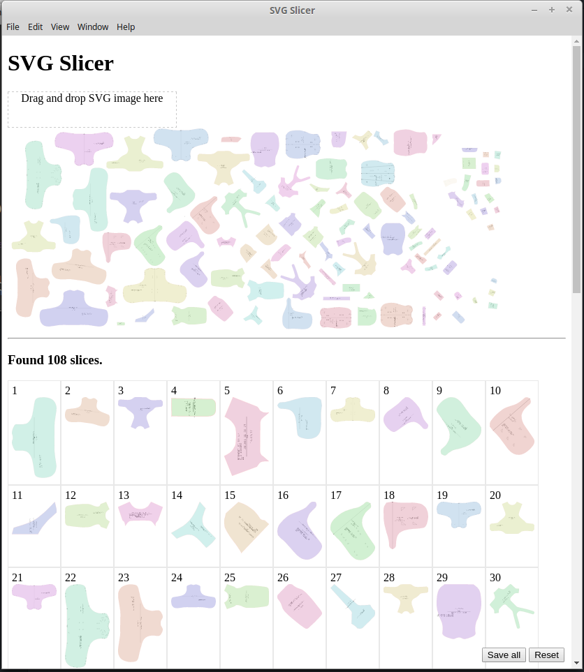

SVG Slicer
---

## Features

- [x] Slice SVG image to multi small images by top <g>
- [x] Fill random color to sliced images
- [x] Save sliced images to png

## DEV

1. Install electron-prebuilt `npm install -g electron-prebuilt gulp`
2. Install required packages `npm install`
3. Run app for dev with livereload `DEV=1 gulp serve`

## Built

1. Install electron packager `npm install -g electron-packager`
2. Built app for windows platform `electron-packager . --platform=win32 --arch=x64,ia32,arm`
3. Built app for linux platform `electron-packager . --platform=linux --arch=x64`
